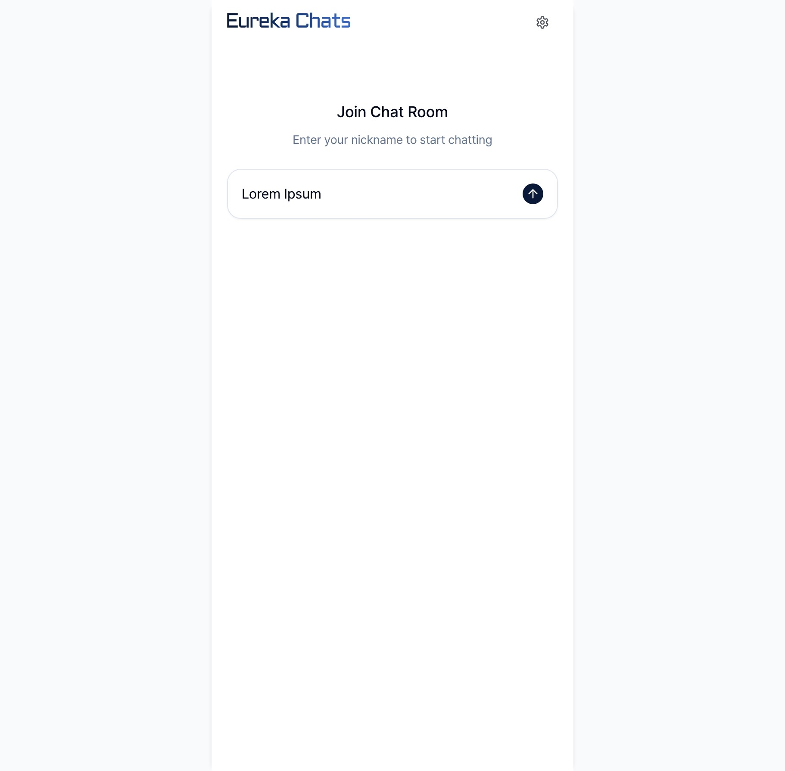
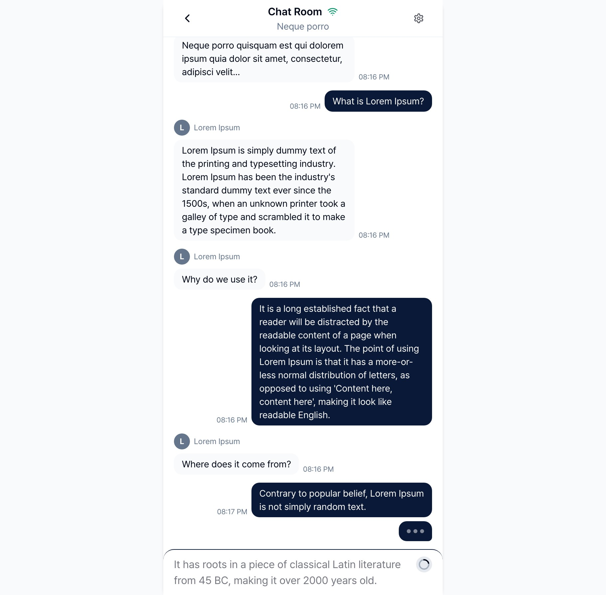

<div align="center">
  <div>
    <h1 align="center">Eureka Chats</h1>
  </div>
  <p>
    Real-time chat template for <a href="https://eureka.codes">EurekaCodes</a> platform
  </p>
</div>

<div align="center" markdown="1">

[](https://eureka.codes)
[](https://github.com/lemoncloud-io)
[](https://nx.dev)

</div>

# About Eureka Chats

Eureka Chats is a real-time chat application template designed specifically for the [EurekaCodes](https://eureka.codes) platform. It provides a complete chat solution that can be deployed instantly within your EurekaCodes workspace.

## Quick Start on EurekaCodes Platform

1. **Subscribe** to [EurekaCodes](https://eureka.codes/)
2. **Create** a new workspace in your dashboard
3. **Select** "Eureka Chats" from the templates
4. **Deploy** with one click - your chat service is ready!

## What's Included

When you deploy Eureka Chats through the [EurekaCodes platform](https://eureka.codes), you get:

-   ✅ **Complete Chat System** - Ready-to-use real-time messaging
-   ✅ **Backend APIs** - All chat APIs pre-configured and hosted
-   ✅ **WebSocket Server** - Managed WebSocket infrastructure
-   ✅ **Auto-scaling** - Handles traffic automatically

## Features

**Real-Time Chat System**

-   Message System: Support for text messages, images, and file sharing
-   Real-Time Communication: WebSocket-based instant messaging
-   Room Management: Create and manage multiple chat rooms

**Modern UI Components**

-   Responsive Design: Mobile-friendly chat interface
-   Accessibility: WCAG compliant UI components
-   Custom Themes: Flexible theming system

**WebSocket Integration**

-   Live Updates: Real-time message delivery and status updates
-   Connection Management: Automatic reconnection and error handling
-   Typing Indicators: Real-time typing status display

## Screenshots

<div align="center">
  
  
</div>

## Tech Stack

-   Frontend Framework: React with TypeScript
-   Project Structure: Nx Monorepo
-   State Management: TanStack Query
-   Styling: Tailwind CSS
-   UI Components: Radix UI
-   Real-time Communication: WebSocket
-   API Integration: Axios

## Project Structure

```
eureka-chats-front/
├── apps/
│   └── web/              # Chat service main entry point
├── libs/
│   ├── web-core/         # API authentication and initialization core library
│   ├── chats/            # Chat related API library
│   ├── ui-kit/           # Common UI kit library
│   ├── shared/           # Common utility library
│   ├── types/            # Common type library
│   └── theme/            # Theme management library
├── scripts/              # Development scripts
├── nx.json               # nx configuration file
└── package.json          # Workspace package manager configuration file
```

## Development

This template is optimized for deployment on the EurekaCodes platform. While you can run it locally for development and customization, the easiest way to use it is through the platform:

### Development Environment

-   Node.js (v20 or higher)
-   npm or yarn
-   Git

### Local Installation

1. Clone the project

```bash
git clone https://github.com/lemoncloud-io/eureka-chats-front.git
cd eureka-chats-front
```

2. Install dependencies

```bash
yarn install
```

3. Environment variable setup

```bash
cp apps/web/.env.example apps/web/.env.local
```

> **Note**: When deploying on [EurekaCodes platform](https://eureka.codes), the environment variables and API endpoints are automatically configured for you. For local development, you'll need to obtain your workspace API credentials from the EurekaCodes dashboard.

4. Run development server

```bash
# Run web service development server
yarn web:start
```

> -   Chat service is accessible at http://localhost:5003

## Contributing

We welcome contributions to Eureka Chats! Please read our contribution guidelines for details on how to submit pull requests, the development process, and coding standards.

## EurekaCodes Platform Integration

This template is designed to work seamlessly within the EurekaCodes ecosystem:

-   **Automatic Deployment**: One-click deployment from the EurekaCodes dashboard
-   **Managed Infrastructure**: No need to worry about servers, scaling, or maintenance
-   **Integrated APIs**: Chat APIs, WebSocket connections, and authentication are pre-configured
-   **Analytics & Monitoring**: Built-in monitoring through the EurekaCodes dashboard

## License

Eureka Chats is licensed under a proprietary license that restricts commercial usage to active EurekaCodes subscribers only. Public access to this repository is provided for evaluation purposes only.

For detailed license terms, please see the LICENSE file.

---

If this project has been helpful, please consider giving it a Star ⭐️!
